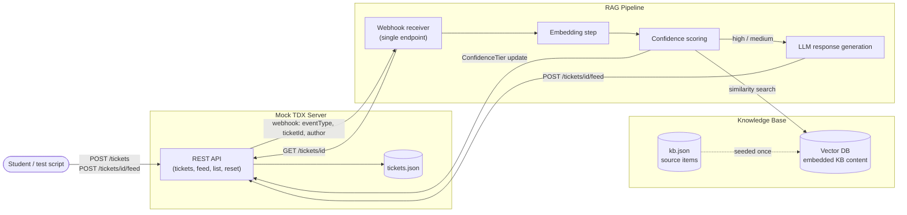
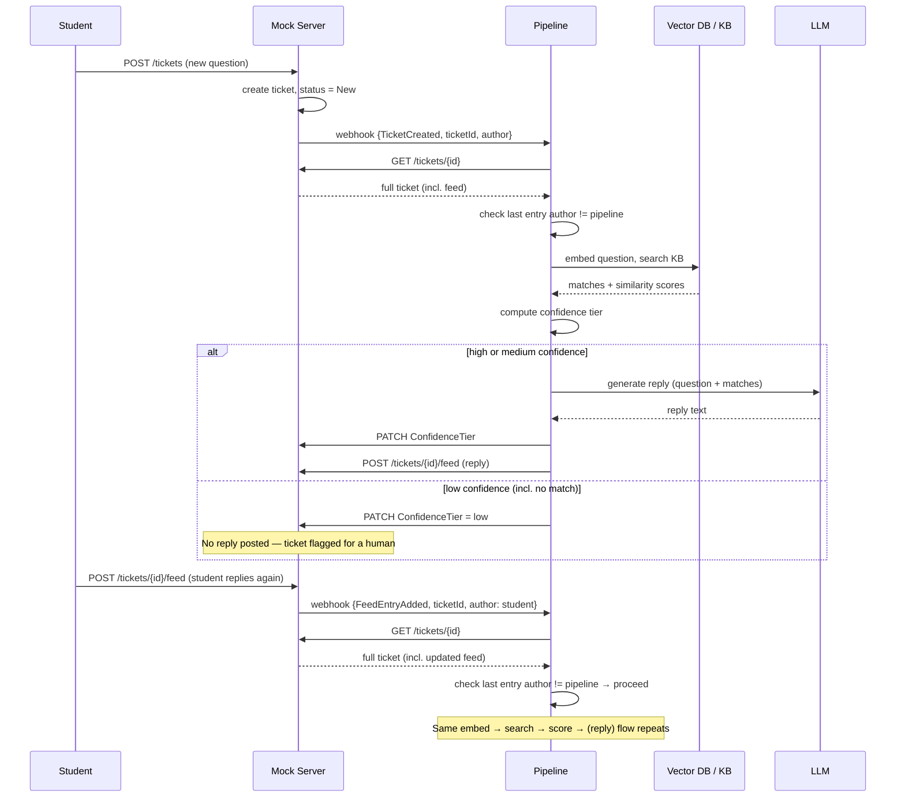

# TDX Mock Sandbox — Architecture Document

## 1. Purpose

This sandbox exists to let the RAG-based ticket-response pipeline be built and tested without depending on access to a real TeamDynamix (TDX) instance. It mimics the parts of TDX's ticketing API that the pipeline actually touches — tickets, feed entries, and event notifications — closely enough that the pipeline's logic would not need to change if it were later pointed at a real TDX system.

The guiding principle throughout this design has been **simplicity over fidelity**: match TDX's real schema and behavior where doing so is cheap and useful, but never add complexity purely for the sake of mimicking TDX more closely than the pipeline actually requires.

---

## 2. End-to-end process

This is what happens, start to finish, for a single exchange between a student and the pipeline:

1. **A ticket is created.** A student (or a test script standing in for one) sends `POST /tickets` to the mock server with a subject and description. The mock writes a new ticket record to its ticket store, with a fresh ticket ID and status `New`.
2. **The mock notifies the pipeline.** The mock fires a webhook to the pipeline's single receiver endpoint: `{"eventType": "TicketCreated", "ticketId": ..., "author": ...}`. No full ticket data rides along — just enough to know something happened and where to look.
3. **The pipeline fetches the full ticket.** On receiving the event, the pipeline calls `GET /tickets/{id}` on the mock and gets back the complete, current ticket record, including its full feed history.
4. **The pipeline checks the author.** Before doing anything else, it confirms the entry that triggered this event wasn't posted by the pipeline itself. If it was, the event is ignored — this is what prevents the pipeline from replying to its own replies.
5. **The ticket text is embedded.** The student's question (for a new ticket) or their latest reply (for an existing one) is converted into a vector embedding.
6. **Vector search runs against the KB.** The embedding is compared against the knowledge base's embedded content, returning the closest matches and their similarity scores.
7. **Confidence scoring decides the path.** Based on how strong the best match is, the ticket is sorted into a tier: **high**, **medium**, or **low**. This tier is recomputed fresh on every single message — nothing is carried forward from earlier in the conversation.
8. **The LLM drafts a reply (high or medium tier only).** The matched KB content is passed to the LLM as context, and it generates a grounded response.
9. **The result is written back.** The ticket's `ConfidenceTier` field is updated in the store. If a reply was generated (high or medium), it's posted as a new feed entry via `POST /tickets/{id}/feed`. If the tier is low — including the case where nothing relevant was found at all — no reply is posted, and the ticket simply sits with its low tier visible, flagged for a human to notice.
10. **A student reply restarts the loop.** If the student responds again, it lands as a new feed entry on the same ticket, the mock fires `FeedEntryAdded` instead of `TicketCreated`, and the process repeats from step 3 — with the pipeline once again fetching the full, current ticket and reasoning over the whole conversation.

Throughout, the ticket ID is the one constant — the key that ties every step, every feed entry, and every webhook back to the same conversation thread.

---

## 3. Component architecture



**Notes on this diagram:**
- The mock server and the pipeline are two independent processes, each with its own address. Nothing is shared in memory — all communication happens over HTTP.
- `tickets.json` and `kb.json` are deliberately separate files. The ticket store is written to continuously as conversations happen; the KB file is written once by a seed script and read repeatedly.
- The vector DB is a dedicated library rather than a brute-force in-memory comparison, per the decision to use real vector search infrastructure even at this small scale.

---

## 4. Data schemas

### 4.1 Ticket object

Field names match TDX's real API exactly, so nothing about this shape would need to change if the pipeline were ever pointed at a real TDX instance. Administrative fields TDX requires for ticket creation but that the pipeline never reads (`ServiceID`, `SourceID`, `AccountID`, `PriorityID`) are intentionally **excluded** — they have no bearing on tracking a conversation and would only add noise.

| Field | Description |
|---|---|
| `ID` | The ticket's unique identifier. The key used everywhere else in the system to reference this conversation. |
| `Title` | Subject line of the ticket. |
| `Description` | The student's original question. |
| `StatusID` / `StatusName` | One of `New`, `In Process`, `Resolved` (see §4.3). |
| `TypeID` / `TypeName` | Ticket type, mirrored from TDX naming. |
| `RequestorEmail` | The student's email. |
| `RequestorUid` | The student's identifier. |
| `ContactFullName` | The student's display name. |
| `CreatedDate` | When the ticket was created. |
| `ModifiedDate` | When the ticket was last updated. |
| `ConfidenceTier` | **Not a real TDX field.** A pragmatic addition: `"high"`, `"medium"`, or `"low"`, reflecting the pipeline's most recent confidence assessment for this ticket. Recomputed on every message. Included directly in the API response for simplicity, rather than mimicked as a private feed note. |
| `Feed` | The list of feed entries for this ticket (see §4.2), ordered by `CreatedDate`. |

### 4.2 Feed entry

| Field | Description |
|---|---|
| `ID` | Unique identifier for this feed entry. |
| `Body` | The text content of the entry (a student's message, or the pipeline's reply). |
| `IsPrivate` | Not used in the current design — every entry the pipeline posts is a real, visible reply. Retained in the schema for TDX fidelity, always `false` for now. |
| `IsRichHtml` | Whether `Body` contains HTML. |
| `CreatedUid` / `CreatedFullName` | **Who posted this entry.** This is the field the pipeline checks to prevent responding to its own replies, and the field that implicitly indicates whose "turn" it is in the conversation. |
| `CreatedDate` | When the entry was posted. |

### 4.3 Status values

A small, custom set — not TDX's full default list:

- **New** — ticket has just been created, not yet processed.
- **In Process** — the conversation is ongoing.
- **Resolved** — the conversation is finished.

No "Waiting on customer" status was added. Whose turn it is in the conversation is already fully recoverable from the last feed entry's author, so a separate status for it would be redundant.

---

## 5. Events and webhook contract

### 5.1 Event types

Two distinct events, fired based on *which action happened* in the mock — never inferred from message content:

- **`TicketCreated`** — fired when `POST /tickets` creates a brand-new ticket.
- **`FeedEntryAdded`** — fired when `POST /tickets/{id}/feed` appends to an existing ticket's feed, regardless of who posted it (student, the pipeline, or a human).

### 5.2 Payload shape

Deliberately minimal — an ID-only push, not a full-object push:

```json
{
  "eventType": "TicketCreated",
  "ticketId": 1044,
  "author": "student"
}
```

- **No timestamp** — the fetched ticket already carries `CreatedDate` / `ModifiedDate`.
- **No explicit feed-entry ID** — the pipeline processes events strictly one at a time (see §6), so "the last entry in the fetched feed" is always unambiguously the one that triggered the event.
- **`author` is included** specifically so the pipeline can cheaply discard events it caused itself, without needing to fetch anything first.

### 5.3 Receiver shape

The pipeline exposes a **single webhook endpoint**. It branches internally on `eventType` rather than having the mock call two different URLs — this keeps the mock simple (one destination, always) and puts all the routing logic in one place on the pipeline side.

### 5.4 Why ID-only, not full-object

Pushing just the ID and having the pipeline fetch the ticket serves two purposes:

1. **Portability** — this is how real TDX webhooks actually behave, so the pipeline's fetch-based logic wouldn't need to change against a real instance.
2. **Correctness under a moving conversation** — a full-object push could hand the pipeline a stale snapshot if entries arrive in quick succession; fetching guarantees the pipeline always reasons over the current, complete state.

---

## 6. Runtime sequence



---

## 7. Confidence scoring behavior

| Tier | Trigger | Pipeline behavior |
|---|---|---|
| **High** | Strong similarity match | Generates and posts an automated reply. `ConfidenceTier` recorded. |
| **Medium** | Moderate similarity match | Generates and posts an automated reply — same path as high, just recorded as less certain. |
| **Low** | Weak or no match at all (a zero/no-match score is treated identically to a merely weak one) | No automated reply. Ticket sits with `ConfidenceTier: "low"`, which is itself the flag that a human needs to step in. |

The exact numeric thresholds that separate these tiers are **not** an architecture decision — they're a tuning detail to be set once the embedding model and real KB content exist and actual score distributions can be observed. Nothing about the sandbox's design depends on where those numbers land.

Every message is scored fresh, independently, every time — there is no shortcut for short replies (e.g., "thanks") and no carrying a tier forward from earlier in the same conversation.

---

## 8. Knowledge base and retrieval

- The KB is a body of reference material (how-to articles, policies, curated past-resolved-ticket Q&A) — separate from live tickets, embedded once and searched repeatedly.
- Each embedded KB item retains a **source ID/title**, so a response can be traced back to what it was generated from.
- **Chunking granularity (whole articles vs. smaller chunks) is explicitly out of scope for this sandbox.** It's a decision internal to the pipeline's own indexing step — the sandbox stores and searches whatever embedded items it's given, regardless of what they represent.
- Similarity search runs through a dedicated vector database library, rather than a brute-force in-memory comparison — chosen deliberately even though the KB's small size wouldn't strictly require it.
- The KB is **static for now** — populated by a seed script, updated manually between runs. Because it lives in its own file, separate from the ticket store, adding automatic growth later (e.g., feeding resolved tickets back in) would be an additive change, not a redesign.

---

## 9. Storage and persistence

- **File-based, not a database** — chosen for simplicity and inspectability.
- **Two separate files:**
  - `tickets.json` — the live ticket store, written to continuously.
  - `kb.json` — the knowledge base source content, written once by a seed script, read on every search.
- Data **persists across restarts** — stopping and restarting the mock does not lose existing tickets or KB content.
- A **seed script** populates initial KB content (and optionally sample tickets) before testing begins; manual ticket/feed creation through the API remains available at any time afterward — both mechanisms coexist.

---

## 10. Mock server endpoints

| Method | Path | Purpose |
|---|---|---|
| `POST` | `/tickets` | Create a new ticket. Fires `TicketCreated`. |
| `GET` | `/tickets/{id}` | Fetch a single ticket, including its full feed. |
| `POST` | `/tickets/{id}/feed` | Append a feed entry to an existing ticket. Fires `FeedEntryAdded`. |
| `GET` | `/tickets` | List all tickets — a debugging/demo convenience. |
| `POST` | `/reset` | Wipe the ticket store back to empty (or the seeded starting state) — for repeatable test runs. |

**Explicitly excluded, by decision:**
- **Authentication** — every request goes through unchecked. Real TDX requires an OAuth token or API key; simulating that would add friction unrelated to what the pipeline is actually being tested for.
- **Simulated failures** — the mock always succeeds. Timeout/error simulation is out of scope for now.
- **A health-check endpoint** — unnecessary for manual, local testing.

---

## 11. Concurrency model

- The ticket store is keyed by ticket ID, which already supports any number of independent students/conversations without any schema change.
- **Event processing is strictly serial** — the pipeline handles one webhook event at a time, regardless of which student or ticket it belongs to. This keeps the "check the last feed entry" logic and the author-based loop check both fully reliable, since nothing else can modify a ticket's feed mid-processing.
- This is a deliberate simplicity trade-off: true concurrent processing across students was considered and set aside, since nothing about the sandbox's actual purpose requires it.

---

## 12. Explicit scope boundaries

Called out here so they're documented decisions, not silent assumptions:

- **Schema fidelity is real-field-name-accurate, not exhaustive.** Unused administrative TDX fields are omitted.
- **`ConfidenceTier` is a sandbox-only field**, not something a real TDX ticket would have. It's a deliberate, acknowledged departure from strict fidelity, made for simplicity.
- **Chunking strategy for KB content is undecided and intentionally out of the sandbox's concern.**
- **No feedback loop from resolved tickets back into the KB** exists yet — the KB is static until/unless that's built later.
- **No authentication, failure simulation, or health-check endpoint** — all explicitly deferred as unnecessary for the sandbox's purpose.

## 13. Open items for implementation

These are real decisions still needed, but they're implementation details rather than architecture:

- The specific vector database library to use.
- The numeric similarity-score thresholds that define high/medium/low confidence.
- The chunking strategy for KB content (whole articles vs. smaller pieces).
- The exact LLM prompt structure for generating grounded replies.
